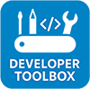

[🇺🇸 English](#-english) | [🇧🇷 Portuguese](#-portugu%C3%AAs)

#  Developer Toolbox

## 🇺🇸 English

This system is a collection of useful tools for a developer's daily routine.

Each challenge we face during our tasks is an opportunity to improve this tool.

If you'd like to contribute, please open an issue in the repository. It will be a pleasure to add your idea to our codebase.

### How is the project organized?

Developer Toolbox is composed of two applications (backend and frontend) that can run on the user's machine. They are based on .NET 9 and Angular 19 respectively. So, if you want to run it locally, make sure you have the required runtime and toolchain.

We also use Postgres as database. Feel free to use any version starting from 14. Although earlier versions might work, we do not guarantee backward compatibility.

The frontend runs on port 4200 (localhost) and is configured to communicate with the backend at port 5139.

### Configuration

The app provides a `docker-compose` setup to bootstrap everything you need. Pay attention to the `*.env.template` files, which contain variables you'll need to configure for your local environment.

#### Service Bus Emulator

You need to configure `./eng/docker/.env`, where you define the place of `config.json` (the one that defines the fake namespace used by the emulator). For more details about this and emulator settings in general, check [this Microsoft manual](https://learn.microsoft.com/en-us/azure/service-bus-messaging/overview-emulator).

#### Developer Toolbox (Backend)

Modify `./eng/docker/backend.env` with the necessary values to run the backend. The template file includes some hints. For security reasons, we don't include a working connection string. Adjust accordingly for your setup.

> 💡 **Tip:** While Developer Toolbox is designed to run on the developer's machine, we recommend sharing the database instance across the team. That way, everyone accesses the same secrets files.

#### Developer Toolbox (Frontend)

Frontend configs are found in `./frontend/src/environments/`, and they are injected at build time. The application will be available at port 8080 in production. This is defined in the reverse proxy configuration found in the docker-compose setup.

> 📢 **Note:** If you change the port, don't forget to also update the Nginx config at `./eng/docker/nginx/reverse-proxy.conf`.

### FAQ

#### ❓Why a Service Bus viewer? Doesn't Service Bus Explorer already do that?

In our testing, Service Bus Explorer was not able to connect to the Service Bus Emulator. We believe this is due to missing APIs in the emulator that the Explorer depends on.

#### ❓Is Developer Toolbox a replacement for Service Bus Explorer?

No. Our app connects only to the Service Bus Emulator. You can try connecting a real queue, but weird behaviors may occur (e.g., topic listing depends on `config.json`). The code is not built to support real Azure Service Bus.

#### ❓Why use a reverse proxy?

Although there are other ways to do it, reverse proxies help eliminate CORS issues. It's also a good exercise for developers not used to reverse proxies or k8s ingresses.

#### ❓Why use sqledge?

It is a requirement for the Service Bus Emulator. It helps emulate message persistence and behavior.

#### ❓Why Postgres?

It's one of the most used open-source databases today — lightweight and easy to configure. If you need support for another DB, open an issue. We can't promise anything, but we may consider multi-database support based on interest.

#### ❓Why not SQLite?

Although SQLite is great in many cases, we prefer Postgres. It’s often easier to add a table in a shared development database than manage and sync individual SQLite files.

---

## 🇧🇷 Português

Este sistema é um amontoado de ferramentas úteis para o cotidiano da pessoa desenvolvedora.

Cada dificuldade que encontramos durante a execução das nossas tarefas, é uma oportunidade de incrementar esta ferramenta.

Caso queira colaborar, por favor, abra uma issue no repositório. Será um prazer poder adicionar a sua ideia à nossa base de código.

### Como o projeto está dividido?

O Developer Toolbox é composto de duas aplicações (backend e frontend) que podem rodar na máquina do usuário. Elas são baseadas em .NET 9 e Angular 19 respectivamente. Portanto, caso queira compilar localmente, você precisa garantir que possui o necessário para rodar a aplicação.

Também utilizamos o banco de dados Postgres para armazenamento. Sinta-se à vontade para utilizar qualquer versão do Postgres à partir da 14 (embora possa existir compatibilidade com versões anteriores, não garantimos a retrocompatibilidade).

A aplicação frontend roda à partir da porta 4200, em localhost e está apontando para a porta 5139, onde espera encontrar a aplicação backend disponível.

### Configurando

A aplicação dispõe de um docker compose, onde é possível levantar tudo que é necessário para iniciar o seu uso. Atente-se para os arquivos `*.env.template` que contém as variáveis que dependem da sua configuração.

#### Service Bus Emulator

É necessário que você configure o arquivo `./eng/docker/.env`. Nele você deve especificar, por exemplo, onde está o arquivo que contém a configuração do "namespace" fictício, utilizado pelo emulador. Para maiores detalhes sobre esse arquivo e configurações em geral do Service Bus Emulator, acesse [este manual da Microsoft](https://learn.microsoft.com/en-us/azure/service-bus-messaging/overview-emulator).

#### Developer Toolbox (Backend)

Configure o arquivo `./eng/docker/backend.env` com as informações necessárias para conseguir executar o backend normalmente. O arquivo de template já possui algumas sugestões. Por motivos de segurança, não adicionamos uma connection string válida para o banco de dados. Faça os ajustes necessários para o seu ambiente local.

> 💡 **Dica:** Developer Toolbox foi pensado para ser executado na máquina do desenvolvedor. Contudo, recomendo que o banco de dados da aplicação seja comum entre os desenvolvedores. Assim todos podem ter acesso aos mesmos arquivos de segredo, cuja intenção é que sejam compartilhados entre o time.

#### Developer Toolbox (Frontend)

As configurações de frontend estão disponíveis em `./frontend/src/environments/`, que são definidas no momento do build da aplicação. Como você irá perceber, a aplicação estará disponível na porta 8080 quando estiver rodando em produção. Essa informação está vinculada as configurações do _proxy-reverso_, que está configurado no docker compose.

> 📢 **Atenção:** Se for alterar essa porta, não esqueça de modificar o arquivo que configura as rotas no Nginx (`./eng/docker/nginx/reverse-proxy.conf`).

### FAQ

#### ❓Por que um visualizador de Service Bus? O Service Bus Explorer já não faz isso?

Em nossos testes, identificamos que o Service Bus Explorer não é capaz de acessar a instância do Service Bus Emulator. A princípio acreditamos que isso se deve a alguma API não implementada pelo Service Bus Emulator e que é requerida pelo Service Bus Explorer.

#### ❓O Service Bus Viewer é uma alternativa o Service Bus Explorer?

Não. Nossa aplicação conecta-se apenas com o Service Bus Emulator. Você até pode conectar uma fila real ao sistema, porém comportamentos estranhos podem acontecer (a listagem de tópicos e filas, por exemplo, é baseada no arquivo `config.json`). O código não está preparado para isso.

#### ❓Por que um proxy reverso?

Apesar de haver outros meios, a utilização de um proxy reverso ajuda a mitigar erros de CORS. Além disso, pode ser um ótimo treino para quem não está habituado a utilizar proxies reversos ou até mesmo _ingresses_ de k8s.

#### ❓Por que utilizar o sqledge?

É um requisito para utilização do Service Bus Emulator, cuja função é ajudar a persistir e emular o comportamento do Service Bus.

#### ❓Por que utilizar o Postgres?

É hoje um dos bancos Open Source mais utilizados na atualidade, é leve e fácil de configurar. Mas caso precise de suporte a outro banco de dados, abra uma issue indicando o banco que gostaria de adicionar suporte. Não garantimos nada, mas pode ser que, com base nas solicitações, possamos caminhar numa direção multi-banco.

#### ❓Por que não utilizar o SQLite ao invés do Postgres?

Apesar de SQLite ser uma solução bastante utilizada nesses cenários, ultimamente, preferimos seguir com o Postgres. Acreditamos que seja mais fácil criar uma tabela a mais no ambiente de desenvolvimento, em um banco já existente, do que comprar um armazenamento apenas para guardar o arquivo do SQLite.
